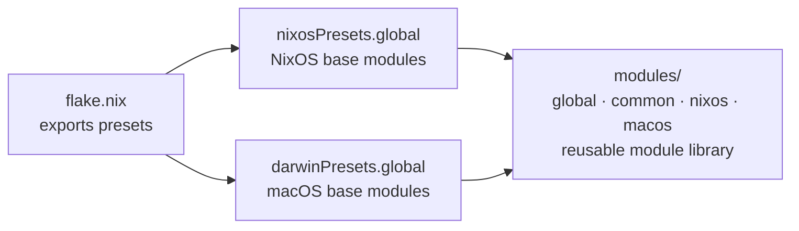
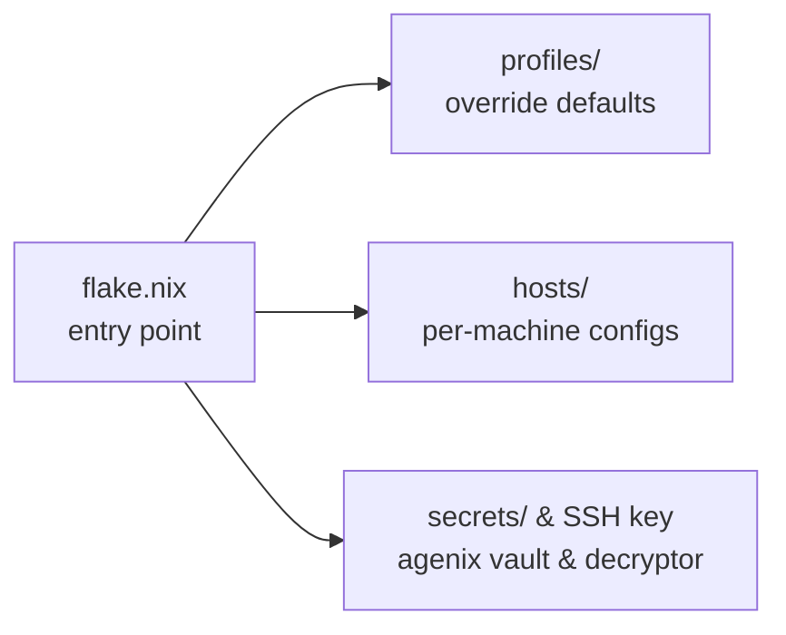

# nix-config

A modular Nix configuration library for NixOS and nix-darwin, built on flakes.

This repository is the **public** half of a two-repo architecture. It exports reusable module presets that a private repository consumes to build actual host configurations. No host definitions, secrets, or personal data live here.

## Flakes and Presets

This repo does **not** define any `nixosConfigurations` or `darwinConfigurations`. Instead, it exports module presets that downstream flakes can import:

```nix
# This repo's flake.nix outputs:
{
  nixosPresets.global = [
    ./modules/global/global.nix
    ./modules/global/nixos.nix
    home-manager.nixosModules.default
    agenix.nixosModules.default
    stylix.nixosModules.stylix
  ];

  darwinPresets.global = [
    ./modules/global/global.nix
    ./modules/global/macos.nix
    home-manager.darwinModules.default
    agenix.darwinModules.default
    stylix.darwinModules.stylix
  ];
}
```

A private repo consumes these presets:

```nix
# Private repo's flake.nix
{
  inputs.nix-config.url = "github:computercam/nix-config";

  outputs = { self, nix-config, nixpkgs, ... }@inputs:
  let
    mc = nix-config;
  in {
    nixosConfigurations.myhost = nixpkgs.lib.nixosSystem {
      system = "x86_64-linux";
      specialArgs = { inherit nix-config; };
      modules = [
        { system.configurationRevision = self.rev or self.dirtyRev or null; }
      ] ++ mc.nixosPresets.global ++ [
        ./profiles/my-profile.nix
        ./hosts/myhost/configuration.nix
      ];
    };
  };
}
```

Module paths are referenced via `${nix-config}/modules/...` interpolation, which works because `nix-config` is passed through `specialArgs`.

## Setup

### Prerequisites

- [Nix](https://nixos.org/download/) with flakes enabled
- A private repository for your host configurations (see below)

### Installing Nix

**NixOS**: Nix is already installed.

**macOS**:
```bash
scripts/nix-install.sh
```

### Setting up the private repository

This public repo is a module library. To define actual hosts, create a private repository that consumes it:

1. **Create a private repo** on GitHub (e.g., `your-username/nix-private`).

2. **Initialize it locally**:
   ```bash
   mkdir nix-private && cd nix-private
   git init && git branch -m main
   git remote add origin git@github.com:your-username/nix-private.git
   ```

3. **Add your SSH key as a submodule** (for agenix secret decryption):
   ```bash
   git submodule add git@github.com:your-username/_.git _
   ```

4. **Create a profile** that sets your personal defaults:

   ```nix
   # profiles/personal.nix
   { config, ... }:
   {
     cfg.user.name = "your-username";
     cfg.user.fullname = "Your Name";
     cfg.user.email = "you@example.com";
     cfg.localization.timezone = "America/New_York";

     # agenix identity path
     age.identityPaths = [
       "${config.users.users."${config.cfg.user.name}".home}/PRIVATE_REPO/_/id_rsa"
     ];
   }
   ```

5. **Create host configurations** under `hosts/`:

   ```nix
   # hosts/myhost/configuration.nix
   { ... }:
   {
     imports = [ ./hardware-configuration.nix ./modules.nix ];
     cfg.os.hostname = "myhost";
     cfg.os.version = "24.11";
     boot.loader.systemd-boot.enable = true;
   }
   ```

   ```nix
   # hosts/myhost/modules.nix
   { nix-config, ... }:
   {
     imports = [
       "${nix-config}/modules/common/home/home.nix"
       "${nix-config}/modules/nixos/service-ssh/service-ssh.nix"
       "${nix-config}/modules/nixos/service-docker/service-docker.nix"
     ];
   }
   ```

6. **Create your `flake.nix`**:

   ```nix
   {
     description = "nix-configurations (private)";

     inputs = {
       nix-config.url = "github:computercam/nix-config";
       nixpkgs.follows = "nix-config/nixpkgs";
       home-manager.follows = "nix-config/home-manager";
       agenix.follows = "nix-config/agenix";
       nix-darwin.follows = "nix-config/nix-darwin";
       stylix.follows = "nix-config/stylix";
     };

     outputs = { self, nix-config, nixpkgs, ... }@inputs:
     let mc = nix-config; in {
       nixosConfigurations.myhost = nixpkgs.lib.nixosSystem {
         system = "x86_64-linux";
         specialArgs = { inherit nix-config; };
         modules = [
           { system.configurationRevision = self.rev or self.dirtyRev or null; }
         ] ++ mc.nixosPresets.global ++ [
           ./profiles/personal.nix
           ./hosts/myhost/configuration.nix
         ];
       };

       darwinConfigurations.mymac = nix-darwin.lib.darwinSystem {
         system = "aarch64-darwin";
         specialArgs = { inherit nix-config; };
         modules = [
           { system.configurationRevision = self.rev or self.dirtyRev or null; }
         ] ++ mc.darwinPresets.global ++ [
           ./profiles/personal.nix
           ./hosts/mymac/configuration.nix
         ];
       };
     };
   }
   ```

7. **Build**:
   ```bash
   # NixOS
   nixos-rebuild switch --flake .#myhost

   # macOS
   darwin-rebuild switch --flake .#mymac
   ```

During development, you can use a local path instead of the GitHub URL:

```nix
nix-config.url = "path:../nix-config";
```

Switch to the GitHub URL when you're ready to share or deploy across machines.

### Secrets

This repo uses [agenix](https://github.com/ryantm/agenix) for secret management. Secrets are:

- **Encrypted** in the private repo under `secrets/*.age`
- **Decrypted** at build time using an SSH key stored in the `_` submodule
- **Referenced** in host modules via `config.age.secrets.<name>.path`

The `age.identityPaths` setting lives in your profile, pointing to the SSH key in the private repo:

```nix
age.identityPaths = [
  "${config.users.users."${config.cfg.user.name}".home}/PRIVATE_REPO/_/id_rsa"
];
```

## Global Options

`modules/global/options.nix` defines shared options with generic defaults. The private repo's profile overrides these with real values.

| Option | Default | Description |
|--------|---------|-------------|
| `cfg.os.name` | `"nixos"` | OS name (`"nixos"` or `"macos"`) |
| `cfg.os.version` | `"latest"` | OS version (→ `system.stateVersion`) |
| `cfg.os.hostname` | `cfg.os.name` | System hostname |
| `cfg.user.name` | `"user"` | Primary username |
| `cfg.user.fullname` | `"User"` | Primary user's full name |
| `cfg.user.email` | `"user@example.com"` | Primary user's email |
| `cfg.shareduser.name` | `"shared"` | Shared files username |
| `cfg.shareduser.group` | `"shared"` | Shared files group |
| `cfg.localization.lang` | `"en_US.UTF-8"` | System language |
| `cfg.localization.timezone` | `"UTC"` | System timezone |
| `cfg.localization.latitude` | `0.0` | Location latitude |
| `cfg.localization.longitude` | `0.0` | Location longitude |
| `cfg.localization.keymap` | `"us"` | Console keymap |
| `cfg.localization.measurement` | `"Metric"` | Measurement units |
| `cfg.localization.temperature` | `"Celsius"` | Temperature units |

Module-specific options (like `cfg.ssh.port`, `cfg.docker.*`, `cfg.networking.*`) are defined in their respective `options.nix` files.

## Architecture

**🌐 Public repo** — modules & presets *(this repo)*



**🔒 Private repo** — hosts, secrets, profiles



The private repo connects to this public repo in two ways: its `flake.nix` declares `inputs.nix-config.url` pointing here, and host configs reference individual modules via `${nix-config}/modules/...` interpolation.

### Why split repos?

- **Privacy**: Host configurations (hardware, filesystems, networking), encrypted secrets, and personal defaults stay private.
- **Shareability**: Generic modules, options, and presets are publishable without leaking anything personal.
- **Separation of concerns**: This repo defines *what a module does*. The private repo decides *which modules to use and how to configure them*.

The private repo overrides generic defaults (like `cfg.user.name = "user"`) through a profile such as `profiles/personal.nix`, which sets real values like `cfg.user.name = "user"` and provides the agenix identity path.

## Modules

All modules live under `modules/`, organized by platform:

```
modules/
├── global/    # Core system config, options, and platform defaults
├── common/    # Cross-platform modules (home-manager, fonts)
├── nixos/     # Linux-only modules (services, desktops, hardware, software)
└── macos/     # macOS-only modules (homebrew, yabai, system defaults)
```

**`global/`** — Core system setup: packages, user creation, zsh, timezone, nix settings, and the `cfg.*` option declarations that the rest of the modules depend on. Included in both presets.

**`common/`** — Home-manager config (git, zsh, shell utilities), dotfiles, and font packages. Works on both NixOS and macOS. Imported directly by hosts via `${nix-config}/modules/common/...`.

**`nixos/`** — Linux-only modules, grouped by prefix:
- **`service-*`** — system services (ssh, docker, networking, avahi, tailscale, etc.)
- **`desktop-environment-*`** — desktop environments (plasma, gnome, xfce)
- **`display-manager-*`** — login managers (gdm, sddm, lightdm)
- **`hardware-*`** — hardware drivers (nvidia)
- **`software-*`** — software bundles (gaming, obs)

**`macos/`** — Homebrew package management, yabai tiling window manager, and macOS system defaults.

### Module Patterns

Modules follow three patterns:

**Pattern A — Flat**: no options, directly sets config values. Used for simple enable-and-configure modules.

```nix
# modules/nixos/service-avahi/service-avahi.nix
{ ... }:
{
  services.avahi = { enable = true; nssmdns4 = true; openFirewall = true; };
}
```

**Pattern B — Options + Config**: exposes `cfg.*` options in a sibling `options.nix`, then reads them in `config`. Host configs can override defaults.

```nix
# modules/nixos/service-ssh/options.nix
{ lib, ... }:
with lib;
{
  options.cfg.ssh.port = mkOption { type = types.int; default = 22; };
}

# modules/nixos/service-ssh/service-ssh.nix
{ config, ... }:
{ imports = [ ./options.nix ]; config.services.openssh.ports = [ config.cfg.ssh.port ]; }

# Override in a host config:
{ cfg.ssh.port = 2222; }
```

**Pattern C — Functional import**: module is a function taking external data (like secret paths), returning a NixOS module. Used for modules that need secret injection.

```nix
# modules/nixos/service-tailscale/service-tailscale.nix
{ tsConfig, ... }:
{
  config.age.secrets.ts_auth_key.file = tsConfig.tsAuthKeyAgePath;
  config.services.tailscale.enable = true;
}

# Imported by the host with arguments:
(import "${nix-config}/modules/nixos/service-tailscale/service-tailscale.nix" {
  tsConfig = { tsAuthKeyPath = config.age.secrets.ts_auth_key.path; tsAuthKeyAgePath = ./secrets/ts_auth_key.age; };
})
```

## Code Style

- Formatted with [nixfmt](https://github.com/NixOS/nixfmt)
- `.editorconfig` enforces 2-space indentation, trailing newlines, and UTF-8
- Option names use the `cfg.*` namespace (e.g., `cfg.ssh.port`, `cfg.docker.networking.bip`)

## Contributing

This is a personal configuration repo, but module improvements and bug fixes are welcome via pull requests. Keep in mind:

- Modules must remain generic — no personal defaults or host-specific data
- Options should have sensible generic defaults
- Follow existing module patterns (A, B, or C as described above)