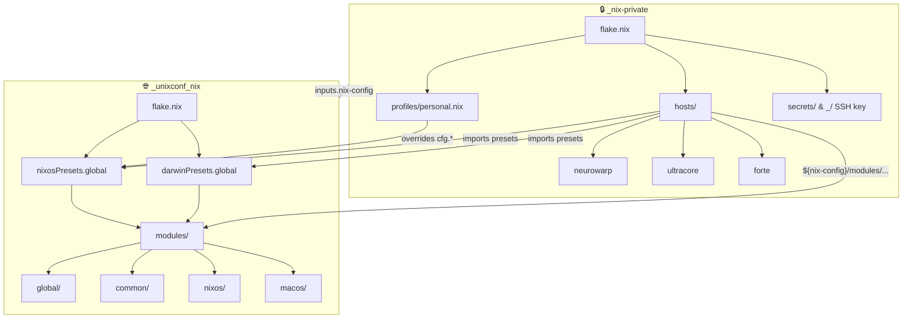

# nix-config

A modular Nix configuration library for NixOS and nix-darwin, built on flakes.

This repository is the **public** half of a two-repo architecture. It exports reusable module presets that a private repository consumes to build actual host configurations. No host definitions, secrets, or personal data live here.

## Architecture



### Why split repos?

- **Privacy**: Host configurations (hardware, filesystems, networking), encrypted secrets, and personal defaults stay private.
- **Shareability**: Generic modules, options, and presets are publishable without leaking anything personal.
- **Separation of concerns**: This repo defines *what a module does*. The private repo decides *which modules to use and how to configure them*.

The private repo overrides generic defaults (like `cfg.user.name = "user"`) through a profile such as `profiles/personal.nix`, which sets real values like `cfg.user.name = "user"` and provides the agenix identity path.

## Flakes and Presets

This repo does **not** define any `nixosConfigurations` or `darwinConfigurations`. Instead, it exports module presets that downstream flakes can import:

```nix
# This repo's flake.nix outputs:
{
  nixosPresets.global = [
    ./modules/global/global.nix
    ./modules/global/nixos.nix
    home-manager.nixosModules.default
    agenix.nixosModules.default
    stylix.nixosModules.stylix
  ];

  darwinPresets.global = [
    ./modules/global/global.nix
    ./modules/global/macos.nix
    home-manager.darwinModules.default
    agenix.darwinModules.default
    stylix.darwinModules.stylix
  ];
}
```

A private repo consumes these presets:

```nix
# Private repo's flake.nix
{
  inputs.nix-config.url = "github:computercam/nix-config";

  outputs = { self, nix-config, nixpkgs, ... }@inputs:
  let
    mc = nix-config;
  in {
    nixosConfigurations.myhost = nixpkgs.lib.nixosSystem {
      system = "x86_64-linux";
      specialArgs = { inherit nix-config; };
      modules = [
        { system.configurationRevision = self.rev or self.dirtyRev or null; }
      ] ++ mc.nixosPresets.global ++ [
        ./profiles/my-profile.nix
        ./hosts/myhost/configuration.nix
      ];
    };
  };
}
```

Module paths are referenced via `${nix-config}/modules/...` interpolation, which works because `nix-config` is passed through `specialArgs`.

## Module System

All modules live under `modules/` and are organized by platform:

```
modules/
├── global/          # Shared between all platforms
│   ├── global.nix   # Core system config (packages, user, timezone, etc.)
│   ├── options.nix  # Global option declarations (cfg.os, cfg.user, cfg.localization, etc.)
│   ├── nixos.nix   # NixOS-specific defaults (boot, i18n, stateVersion)
│   └── macos.nix   # macOS-specific defaults (stateVersion, primaryUser)
├── common/          # Shared modules (work on both platforms)
│   ├── fonts/       # Font configuration
│   └── home/        # Home-manager config, dotfiles, zsh
├── nixos/           # NixOS-only modules
│   ├── service-*/   # System services (docker, ssh, avahi, etc.)
│   ├── hardware-*/  # Hardware drivers (nvidia)
│   ├── desktop-*/   # Desktop environments (plasma, gnome, xfce)
│   ├── display-*/   # Display managers (gdm, sddm, lightdm)
│   └── software-*/  # Software bundles (gaming, obs)
└── macos/           # macOS-only modules
    ├── service-homebrew/
    ├── service-yabai/
    └── system-defaults/
```

### Module Patterns

Modules in this repo follow three patterns:

#### Pattern A — Flat module

Simple modules with no configurable options. The file directly sets configuration values.

```nix
# modules/nixos/service-avahi/service-avahi.nix
{ ... }:
{
  services.avahi = {
    enable = true;
    nssmdns4 = true;
    openFirewall = true;
  };
}
```

#### Pattern B — Options + Config

Modules that expose configurable options under `cfg.*`, then use those options in the `config` block. Options live in a sibling `options.nix`.

```nix
# modules/nixos/service-ssh/options.nix
{ config, lib, ... }:
with lib;
{
  options.cfg.ssh = {
    port = mkOption {
      type = types.int;
      default = 22;
      description = "SSH Port";
    };
  };
}

# modules/nixos/service-ssh/service-ssh.nix
{ config, lib, pkgs, ... }:
with lib;
{
  imports = [ ./options.nix ];
  config = {
    services.openssh = {
      enable = true;
      ports = [ config.cfg.ssh.port ];
      # ...
    };
  };
}
```

This pattern lets host configs override defaults:

```nix
# In a host configuration:
{ cfg.ssh.port = 2222; }
```

#### Pattern C — Functional import

Modules that need external data (like secret file paths) injected at call time. The module file is a function returning a NixOS module:

```nix
# modules/nixos/service-tailscale/service-tailscale.nix
{ tsConfig, ... }:
let
  tsAuthKeyPath = tsConfig.tsAuthKeyPath;
in
{
  config = {
    age.secrets.ts_auth_key.file = tsAuthKeyAgePath;
    services.tailscale.enable = true;
    # ...
  };
}
```

Imported by the host with arguments:

```nix
imports = [
  (import "${nix-config}/modules/nixos/service-tailscale/service-tailscale.nix" {
    tsConfig = {
      tsAuthKeyPath = config.age.secrets.ts_auth_key.path;
      tsAuthKeyAgePath = ./secrets/ts_auth_key.age;
    };
  });
];
```

### Global Options

The `modules/global/options.nix` file defines shared options with generic defaults. The private repo's profile overrides these with real values.

| Option | Default | Description |
|--------|---------|-------------|
| `cfg.os.name` | `"nixos"` | Operating system name (`"nixos"` or `"macos"`) |
| `cfg.os.version` | `"latest"` | OS version (maps to `system.stateVersion`) |
| `cfg.os.hostname` | `cfg.os.name` | System hostname |
| `cfg.user.name` | `"user"` | Primary username |
| `cfg.user.fullname` | `"User"` | Primary user's full name |
| `cfg.user.email` | `"user@example.com"` | Primary user's email |
| `cfg.shareduser.name` | `"shared"` | Shared files username |
| `cfg.shareduser.group` | `"shared"` | Shared files group |
| `cfg.localization.lang` | `"en_US.UTF-8"` | System language |
| `cfg.localization.timezone` | `"UTC"` | System timezone |
| `cfg.localization.latitude` | `0.0` | Location latitude (for redshift/stylix) |
| `cfg.localization.longitude` | `0.0` | Location longitude |
| `cfg.localization.keymap` | `"us"` | Console keymap |
| `cfg.localization.measurement` | `"Metric"` | Measurement units |
| `cfg.localization.temperature` | `"Celsius"` | Temperature units |

Module-specific options (like `cfg.ssh.port`, `cfg.docker.*`, `cfg.networking.*`) are defined in their respective `options.nix` files.

## Module Reference

### Global (shared)

| Module | Description |
|--------|-------------|
| `global/global.nix` | Core system packages, user creation, zsh, timezone, nix settings |
| `global/options.nix` | Option declarations for `cfg.os`, `cfg.user`, `cfg.localization`, `cfg.shareduser` |
| `global/nixos.nix` | NixOS boot settings, i18n, `stateVersion`, shared user/group |
| `global/macos.nix` | macOS `stateVersion`, `primaryUser` |

### Common (cross-platform)

| Module | Description |
|--------|-------------|
| `common/home/home.nix` | Home-manager: git, zsh, shell utilities, system tools |
| `common/home/dotfiles.nix` | Dotfile management |
| `common/home/getZshInitExtra.nix` | Zsh init helper (functional) |
| `common/home/zshInitExtraConfig.nix` | Zsh init configuration (functional) |
| `common/fonts/fonts.nix` | Font packages |

### NixOS

| Module | Pattern | Options |
|--------|----------|---------|
| `service-avahi` | A | — |
| `service-audio` | A | — |
| `service-audio-daw` | A | — |
| `service-cloudflared` | C | Requires `cloudflaredConfig` |
| `service-cron` | A | — |
| `service-docker` | B | `cfg.docker.*`, `cfg.networking.*` |
| `service-firewall` | A | — |
| `service-flatpak` | A | — |
| `service-kvm` | B | `cfg.kvm.*` |
| `service-monitoring` | A | — |
| `service-networking` | B | `cfg.networking.*` |
| `service-phone` | A | — |
| `service-podman` | A | — |
| `service-printing` | A | — |
| `service-resiliosync` | B | `cfg.resilio.*` |
| `service-samba` | B | `cfg.samba.*` |
| `service-ssh` | B | `cfg.ssh.port` |
| `service-sudo` | A | — |
| `service-tailscale` | C | Requires `tsConfig` |
| `service-virtualbox` | A | — |
| `desktop-environment` | A | — |
| `desktop-environment-gnome` | A | — |
| `desktop-environment-plasma` | A | — |
| `desktop-environment-xfce` | A | — |
| `display-manager-gdm` | A | — |
| `display-manager-lightdm` | A | — |
| `display-manager-sddm` | A | — |
| `hardware-nvidia` | A | — |
| `software-gaming` | A | — |
| `software-obs` | A | — |

### macOS

| Module | Pattern | Description |
|--------|----------|-------------|
| `service-homebrew` | A | Homebrew package management |
| `service-yabai` | A | Tiling window manager |
| `system-defaults` | A | macOS system preferences |

## Setup

### Prerequisites

- [Nix](https://nixos.org/download/) with flakes enabled
- A private repository for your host configurations (see below)

### Installing Nix

**NixOS**: Nix is already installed.

**macOS**:
```bash
scripts/nix-install.sh
```

### Setting up the private repository

This public repo is a module library. To define actual hosts, create a private repository that consumes it:

1. **Create a private repo** on GitHub (e.g., `your-username/nix-private`).

2. **Initialize it locally**:
   ```bash
   mkdir nix-private && cd nix-private
   git init && git branch -m main
   git remote add origin git@github.com:your-username/nix-private.git
   ```

3. **Add your SSH key as a submodule** (for agenix secret decryption):
   ```bash
   git submodule add git@github.com:your-username/_.git _
   ```

4. **Create a profile** that sets your personal defaults:

   ```nix
   # profiles/personal.nix
   { config, ... }:
   {
     cfg.user.name = "your-username";
     cfg.user.fullname = "Your Name";
     cfg.user.email = "you@example.com";
     cfg.localization.timezone = "America/New_York";

     # agenix identity path
     age.identityPaths = [
       "${config.users.users."${config.cfg.user.name}".home}/PRIVATE_REPO/_/id_rsa"
     ];
   }
   ```

5. **Create host configurations** under `hosts/`:

   ```nix
   # hosts/myhost/configuration.nix
   { ... }:
   {
     imports = [ ./hardware-configuration.nix ./modules.nix ];
     cfg.os.hostname = "myhost";
     cfg.os.version = "24.11";
     boot.loader.systemd-boot.enable = true;
   }
   ```

   ```nix
   # hosts/myhost/modules.nix
   { nix-config, ... }:
   {
     imports = [
       "${nix-config}/modules/common/home/home.nix"
       "${nix-config}/modules/nixos/service-ssh/service-ssh.nix"
       "${nix-config}/modules/nixos/service-docker/service-docker.nix"
     ];
   }
   ```

6. **Create your `flake.nix`**:

   ```nix
   {
     description = "nix-configurations (private)";

     inputs = {
       nix-config.url = "github:computercam/nix-config";
       nixpkgs.follows = "nix-config/nixpkgs";
       home-manager.follows = "nix-config/home-manager";
       agenix.follows = "nix-config/agenix";
       nix-darwin.follows = "nix-config/nix-darwin";
       stylix.follows = "nix-config/stylix";
     };

     outputs = { self, nix-config, nixpkgs, ... }@inputs:
     let mc = nix-config; in {
       nixosConfigurations.myhost = nixpkgs.lib.nixosSystem {
         system = "x86_64-linux";
         specialArgs = { inherit nix-config; };
         modules = [
           { system.configurationRevision = self.rev or self.dirtyRev or null; }
         ] ++ mc.nixosPresets.global ++ [
           ./profiles/personal.nix
           ./hosts/myhost/configuration.nix
         ];
       };

       darwinConfigurations.mymac = nix-darwin.lib.darwinSystem {
         system = "aarch64-darwin";
         specialArgs = { inherit nix-config; };
         modules = [
           { system.configurationRevision = self.rev or self.dirtyRev or null; }
         ] ++ mc.darwinPresets.global ++ [
           ./profiles/personal.nix
           ./hosts/mymac/configuration.nix
         ];
       };
     };
   }
   ```

7. **Build**:
   ```bash
   # NixOS
   nixos-rebuild switch --flake .#myhost

   # macOS
   darwin-rebuild switch --flake .#mymac
   ```

During development, you can use a local path instead of the GitHub URL:

```nix
nix-config.url = "path:../nix-config";
```

Switch to the GitHub URL when you're ready to share or deploy across machines.

### Secrets

This repo uses [agenix](https://github.com/ryantm/agenix) for secret management. Secrets are:

- **Encrypted** in the private repo under `secrets/*.age`
- **Decrypted** at build time using an SSH key stored in the `_` submodule
- **Referenced** in host modules via `config.age.secrets.<name>.path`

The `age.identityPaths` setting lives in your profile, pointing to the SSH key in the private repo:

```nix
age.identityPaths = [
  "${config.users.users."${config.cfg.user.name}".home}/PRIVATE_REPO/_/id_rsa"
];
```

## Code Style

- Formatted with [nixfmt](https://github.com/NixOS/nixfmt)
- `.editorconfig` enforces 2-space indentation, trailing newlines, and UTF-8
- Option names use the `cfg.*` namespace (e.g., `cfg.ssh.port`, `cfg.docker.networking.bip`)

## Contributing

This is a personal configuration repo, but module improvements and bug fixes are welcome via pull requests. Keep in mind:

- Modules must remain generic — no personal defaults or host-specific data
- Options should have sensible generic defaults
- Follow existing module patterns (A, B, or C as described above)